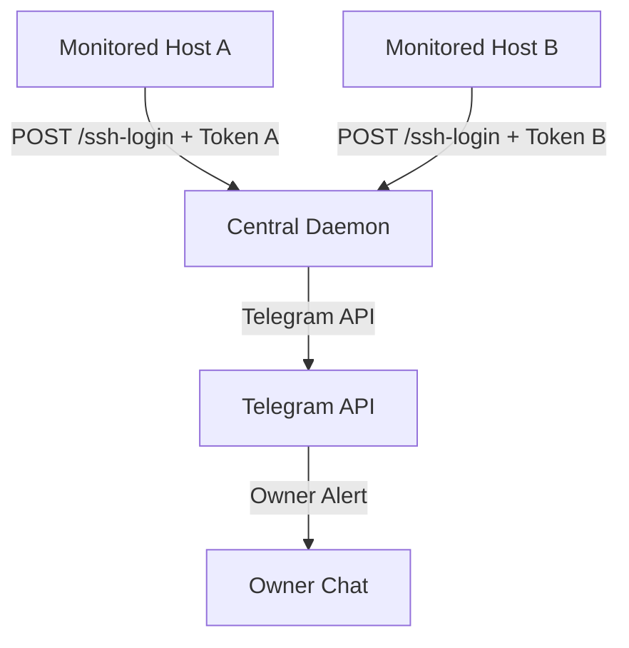

# SSH Notify Bot

SSH Notify Bot is a Go-based system designed to send real-time alerts to Telegram whenever an SSH connection is established on your servers. It is optimized for security, minimal resource footprint, and multi-server administration.

## Architecture

The system is split into two components:
1. **Central Daemon:** A single Go application running on a central server. It runs the Telegram bot listener (using `github.com/go-telegram/bot`) and exposes an authenticated HTTP endpoint (`POST /ssh-login`). Data is persisted in a local SQLite database.
2. **Client Hook:** A lightweight, dependency-free shell script running on monitored hosts. When an SSH session opens, Linux Pluggable Authentication Modules (PAM) invokes the script. The script makes a fast HTTP POST to the central daemon to report the login details.

### Key Advantages of Centralized Monitoring

- **Client Safety:** Client servers do not run background daemons or compile libraries. They require only `curl` and a standard POSIX shell script.
- **Credential Isolation:** The Telegram Bot Token is stored only on the central daemon server. Individual client servers only hold a unique server access token. If a client server is compromised, revoking its token does not compromise the bot or leak the Telegram token.
- **Flexible Alert Routing:** A single bot can route notifications to multiple authorized Telegram chats (e.g. personal threads, security channels, or admin group chats).

## Features

- **Owner-Only Commands:** Commands to configure the bot are restricted to the configured `OWNER_USER_ID` to prevent unauthorized control.
- **SQLite Persistence:** All configurations, including authorized destination chats and registered servers/tokens, are stored locally using a pure Go SQLite engine.
- **Server Token CRUD:** Create, rename, delete, and regenerate tokens dynamically via Telegram chat interface.
- **Dynamic Chat Authorization:** Use the `/authchat` command in any Telegram thread to enable it to receive SSH notifications.

## Installation and Configuration

For complete deployment instructions, including systemd service files, PAM configurations, and bot command references, see the [Setup Guide](docs/setup.md).

## License

This project is licensed under the MIT License - see the LICENSE file for details.